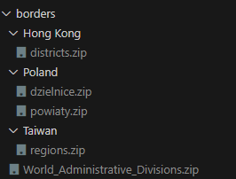

# Regions counter

A simple python script to calculate in how many sub-divisions cubers compted in (made with polish voivodeships in mind).

The results of this script get uploaded to my [nekoweb site](https://shab.nekoweb.org/regions/) daily.

For all countries that ever held a WCA competition, it gets its subdivisions and their names from [this shapefile.](https://hub.arcgis.com/datasets/56633b40c1744109a265af1dba673535_0)

## Running it locally

- Clone the repo and cd into it
- Create a `dbsecrets.py` file with the `SECRET_HOST`, `SECRET_USER`, `SECRET_DATABASE`, `SECRET_PASSWORD` fields with the credentials needed to connect to your database.
- Load the [results export](https://www.worldcubeassociation.org/export/results) onto that database.
- Create a folder called `borders`
- Download the shapefiles from [this list](/shapefile-sources.md) and put them in folders as such

- Create a python virtual environment `python3 -m venv .venv`
- Install the requirements `./venv/bin/pip install -e .`
- Run the main script `./venv/bin/python __main__.py`

## Uploading to nekoweb

- Create a `nekoweb_secrets.py` file with the `API_KEY` and `BASE_PATH` fields.
- `API_KEY` is the key you can get [from here](https://nekoweb.org/api), `BASE_PATH` is the path you wish the results get uploaded to, in my case `/shab.nekoweb.org/regions`
- Note: that folder must exist before running the script.
- Run the upload script `./venv/bin/python nekoweb_uploader.py`
